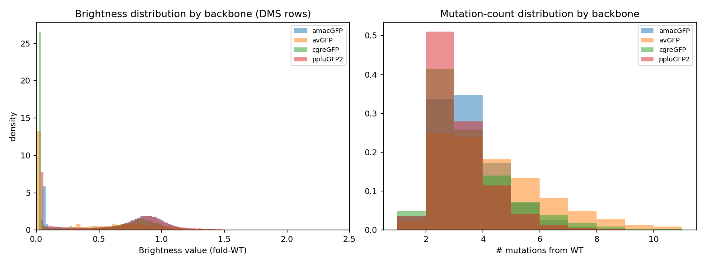
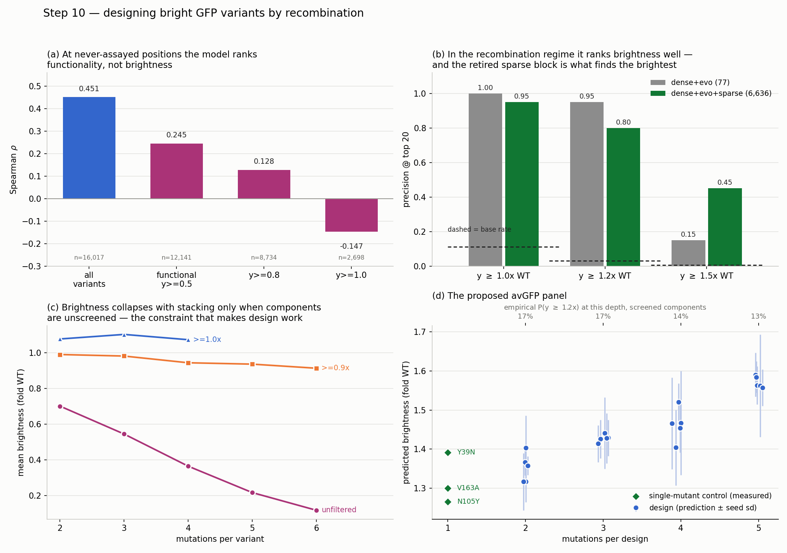
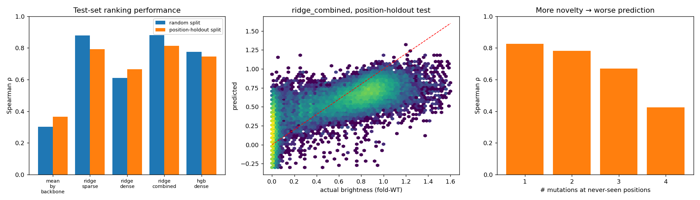
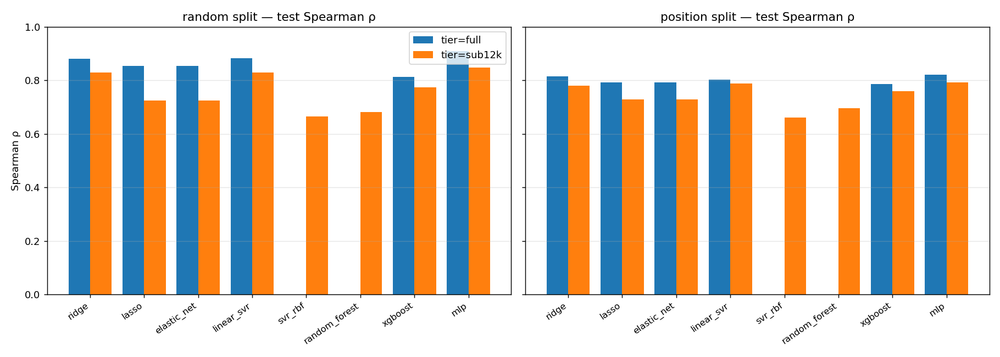
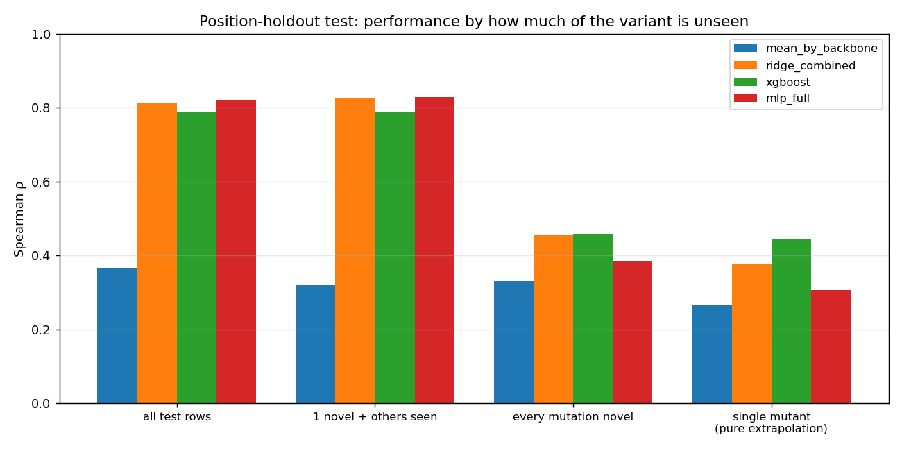
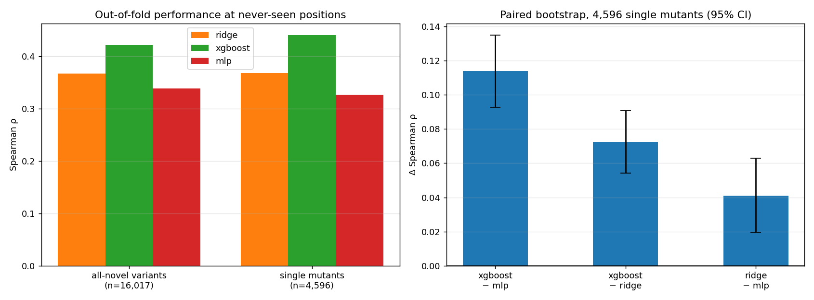
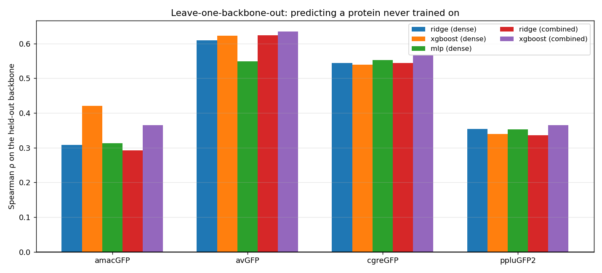
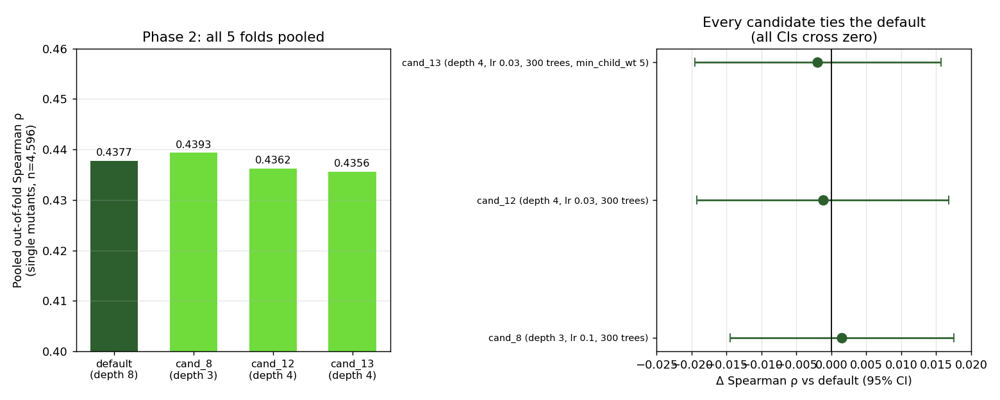
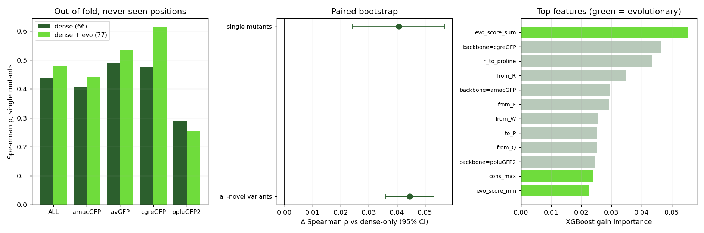
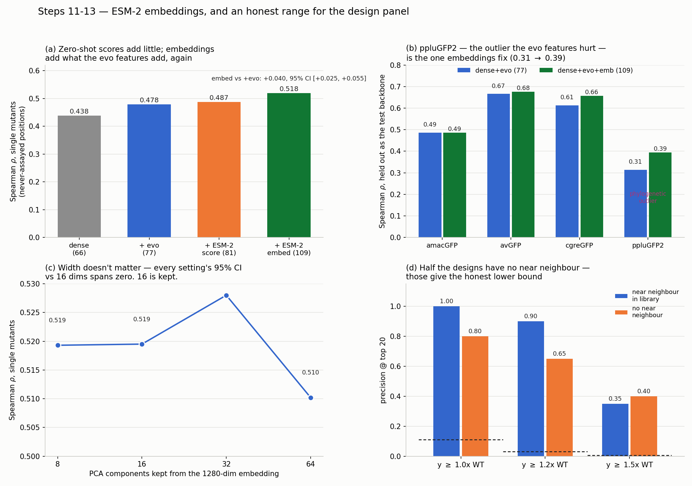

# Results

Every script in this repository was executed end to end on a clean clone, in dependency
order, and the numbers and figures below are what those runs produced — not values
copied from the project log. Where a result differs from the one recorded in
[`EDA_summary.md`](EDA_summary.md) or [`PROJECT_HANDOFF.md`](PROJECT_HANDOFF.md), the
difference is stated rather than smoothed over.

The document is split the same way the code is: **Part A** covers `pipeline/`, the steps
that turn raw spreadsheets into features and designs, and **Part B** covers
`experiments/`, the benchmarks that decide which model and which features to believe.
Every figure is labelled with the script that produced it.

**Run environment:** Linux, 2 CPUs, Python 3.11, pandas 3.0.2, numpy 2.4.4,
scikit-learn 1.8.0, xgboost 3.2.0, torch 2.14.0+cpu, transformers 5.17.0, node 22.22.2.
ESM-2 weights (`facebook/esm2_t33_650M_UR50D`) downloaded from HuggingFace at runtime.

## Execution status

All 31 scripts ran to completion. Four required something the run order alone does not
tell you; those are detailed in [Issues found](#issues-found) at the end.

| | Scripts | Result |
|---|---|---|
| `pipeline/` | 01, 02, 03, 12, 16, 17, 21, 22 | 8/8 pass |
| `experiments/` | 04–11, 13–15, 18–20, 23–31 | 23/23 pass |

---

# Part A — Pipeline

## 1. Cleaning and merging the source data

`pipeline/01_clean_gfp_data.py`

The 15 source workbooks merge to 141,469 rows. Dropping 3 sequences with unresolved `X`
residues and 316 rows with no usable brightness label leaves **141,150 rows**, of which
141,144 are DMS measurements and 6 are engineered classics held separately because they
sit on a different assay scale.

| Backbone | Rows |
|---|---|
| avGFP | 51,721 |
| amacGFP | 33,511 |
| ppluGFP2 | 31,402 |
| cgreGFP | 24,516 |

**Figure 1 — produced by `pipeline/01_clean_gfp_data.py`.** Left: the brightness label is
sharply bimodal in all four backbones — a tall spike at zero (non-functional variants,
about a third of the data) and a broad peak just below 1.0× wild-type. This shape is the
single most consequential property of the dataset: an additive model cannot express "one
lethal mutation kills the protein", which is why the linear baselines later fail
specifically on the dark mode. Right: mutation counts are low-order, concentrated at 2–3
per variant and tailing off past 6, so these are combinatorial libraries rather than
deeply mutated ones — which is what makes a naive random split leak so badly.

## 2. Train / validation / test splits

`pipeline/02_make_splits.py`

Three schemes, all excluding the 6 engineered rows. Sizes reproduce the log exactly.

| Scheme | Train | Val | Test |
|---|---|---|---|
| `split_random` | 112,914 | 14,115 | 14,115 |
| `split_position_holdout` | 83,986 | 27,609 | 29,549 |

Every leakage check passed: **zero** training rows touch a held-out position in any of the
four backbones, and the random split has **zero** duplicate-sequence groups spanning
splits. The position-holdout split shows 2 such groups — the known biological curiosity
where an avGFP wild-type sequence is byte-identical to a heavily mutated amacGFP variant,
not a bug.

## 3. Feature construction

`pipeline/03_build_features.py`

Two blocks over 141,144 eligible rows, mean 3.27 mutations per row:

- **Sparse**, 6,559 columns — one indicator per `(backbone, position, mutant AA)`.
  461,729 non-zeros, density 4.99 × 10⁻⁴.
- **Dense**, 66 columns — transferable descriptors (BLOSUM62, hydropathy, volume, charge,
  composition, mutation count, backbone one-hot).

The distinction runs through the whole project: the sparse block is powerful inside a
known library and structurally empty for any position the assay never touched.

## 4. Wild-type reconstruction

`pipeline/12_derive_wt_sequences.py`

Each backbone's wild-type was rebuilt by independently reverting every variant's own
mutations and taking a consensus — 238, 238, 235 and 222 aa for avGFP, amacGFP, cgreGFP
and ppluGFP2. The reversions agree on all but one row, the `avGFP (parent, F64L)` entry,
confirming that this dataset's mutation numbering is relative to the **F64L library
parent** rather than literal wild-type avGFP.

## 5. Cross-backbone alignment

`pipeline/16_align_backbones.py`

Needleman–Wunsch with BLOSUM62 and affine gaps, star topology against avGFP. Every
residue of every backbone maps (238/238, 238/238, 235/235, 222/222). Both built-in
validations pass: the chromophore Tyr66–Gly67 lands in the same two alignment columns in
all four backbones, and pairwise identities reproduce the known phylogeny.

## 6. Evolutionary features

`pipeline/17_evo_features.py`

Eleven cross-homolog features per variant — conservation, `mut_in_homolog`, and an
`evo_score` shaped like a log-odds ratio — derived only from the four wild-type sequences,
so no label information can leak across a fold. These turn out to be the first thing in
the project that moves the extrapolation number (§15).

## 7. Design by recombination

`pipeline/21_design_variants.py`

The design oracle, its benchmark, and the beam search. Restricting the extension pool to
substitutions individually measured at ≥ 0.95× wild-type and capping depth at 5, the top
designs are consistent 5-mutation recombinations:

| Design | Predicted brightness | Seed sd | Weakest component |
|---|---|---|---|
| Y39N:N105Y:E111Q:V163A:I188L | 1.590 | 0.056 | 1.125 |
| Y39N:T62S:N105Y:V163A:I188L | 1.584 | 0.040 | 1.123 |
| D19E:Y39N:N105Y:V163A:I188L | 1.563 | 0.049 | 1.125 |

## 8. The design panel

`pipeline/22_make_design_report.py`

**Figure 2 — produced by `pipeline/22_make_design_report.py`.** Panel (a) is the warning
that shapes the whole design strategy: the model's ρ ≈ 0.45 at never-assayed positions
decays to 0.245 among functional variants, 0.128 above 0.8× WT, and goes **negative**
(−0.147) above 1.0× WT. At unseen positions the model ranks whether a protein folds, not
how bright it is. Panel (b) shows the reversal that makes design work anyway — in the
recombination regime the sparse block, retired as dead weight for extrapolation, is
exactly what finds the brightest variants (precision@20 at y ≥ 1.5 rises 0.15 → 0.45).
Panel (c) explains why stacking mutations is safe when components are screened: brightness
collapses with depth only in the unfiltered curve, and holds roughly flat when every
component is individually ≥ 0.9× WT. Panel (d) is the proposed avGFP panel, predictions
with seed-ensemble error bars, against three measured single-mutant controls.

Ranking all characterised avGFP substitutions, the oracle independently places **V163A,
Y39N, I171V and Y145F** — four superfolder-GFP mutations — inside its top 60, with no
literature input anywhere in the pipeline.

---

# Part B — Experiments

## 9. Ridge baselines

`experiments/04_train_baselines.py`, `experiments/05_analyze_results.py`

Test-set Spearman ρ, both splits:

| Model | Random | Position-holdout |
|---|---|---|
| mean-by-backbone (floor) | 0.3026 | 0.3660 |
| ridge, sparse only | 0.8780 | 0.7924 |
| ridge, dense only | 0.6099 | 0.6657 |
| **ridge, combined** | **0.8802** (R² 0.7049) | **0.8135** (R² 0.5516) |
| HistGradientBoosting, dense | 0.7757 | 0.7447 |

**Figure 3 — produced by `experiments/05_analyze_results.py`.** Left: the headline
position-holdout numbers look nearly as good as the random split, which is misleading.
Centre: the predicted-vs-actual density shows the failure mode — a dense blob of variants
whose true brightness is ~0 but which are predicted at 0.5–0.75, the additive model unable
to represent a single lethal mutation. Right: the illusion resolved. As more of a variant
is genuinely novel, ρ falls from 0.83 with one unseen position to 0.42 with four.

The decisive number is in the breakdown: on the 293 pure single-mutant extrapolation rows,
`ridge_sparse` scores **0.2680 — exactly the mean-predictor floor**, as it must, since a
never-seen position has no fitted coefficient. Only the dense descriptors carry signal
there (0.3874).

## 10. Eight model families, 104 configurations

`experiments/06_compare_models.py`, `experiments/07_summarize_comparison.py`

All 104 configurations completed across both splits, hyperparameters selected on
validation only. Full-tier test results:

| Model | Random ρ | Random R² | Position ρ | Position R² |
|---|---|---|---|---|
| linear_svr | **0.8819** | 0.6924 | 0.8030 | 0.4503 |
| ridge | 0.8802 | **0.7049** | **0.8138** | 0.5523 |
| lasso | 0.8545 | 0.6532 | 0.7930 | 0.4207 |
| elastic_net | 0.8541 | 0.6528 | 0.7928 | 0.4207 |
| xgboost | 0.8130 | 0.6654 | 0.7863 | **0.6090** |

**Figure 4 — produced by `experiments/07_summarize_comparison.py`.** Blue bars are models
trained on the full training split, orange on the fixed 12,000-row subsample that lets all
eight families be compared on equal data. Random forest and kernel SVR appear only in
orange because neither scales to 113k rows, and both are clearly weakest (ρ ≈ 0.66–0.70) —
high-dimensional sparse binary input suits them badly. L1 is actively harmful: lasso and
elastic_net trail ridge and both chose the smallest penalty offered. The MLP's full-tier
bar is the tallest on the random split at ρ 0.9096 — but it only appears if `08` has run
**before** `07`, because `06` never trains the MLP at full scale and `08` is what writes
that row into `model_comparison.csv`. Following the plain numeric order leaves the MLP
with an orange bar only, understating the best model by about 0.06 ρ.

## 11. The full-data MLP, and whether it survives extrapolation

`experiments/08_train_mlp_full.py`, `experiments/09_analyze_extrapolation.py`

| Split | Epochs | Val ρ | Test ρ | Test R² |
|---|---|---|---|---|
| random (α = 1e-4) | 10 | 0.9136 | **0.9096** | **0.8713** |
| position (α = 1e-3) | 11 | 0.8126 | 0.8200 | 0.6403 |

The MLP is the best interpolation model, and its R² advantage over ridge (0.871 vs 0.705)
is much wider than its ranking advantage — it is capturing the non-additive dark mode the
linear models cannot express.

**Figure 5 — produced by `experiments/09_analyze_extrapolation.py`.** The ordering inverts
as novelty increases. On all test rows the MLP (red) leads; by the rightmost group — single
mutants at never-seen positions — it has fallen to 0.306, below ridge at 0.378, while
XGBoost (green), which finished near-last on the headline metric, leads at 0.443. The
MLP's entire advantage comes from recombining mutations it has already seen. Note also how
little daylight separates any model from the floor (blue) in the two right-hand groups.

## 12. The extrapolation benchmark, settled

`experiments/10_cross_val_extrapolation.py`, `experiments/11_analyze_extrapolation_cv.py`

Five-fold cross-validation over positions tests every variant exactly once by a model that
never saw any of its positions — 4,596 single mutants instead of 293.

| Subset | n | ridge | **xgboost** | mlp |
|---|---|---|---|---|
| all-novel variants | 16,017 | 0.3673 | **0.4215** | 0.3391 |
| single mutants | 4,596 | 0.3683 | **0.4410** | 0.3270 |
| single — amacGFP | 1,201 | 0.2506 | **0.3840** | 0.1773 |
| single — avGFP | 1,085 | 0.3526 | **0.4418** | 0.2990 |
| single — cgreGFP | 1,169 | 0.3953 | **0.4962** | 0.4214 |
| single — ppluGFP2 | 1,141 | 0.2985 | **0.3005** | 0.2774 |

**Figure 6 — produced by `experiments/11_analyze_extrapolation_cv.py`.** Left: XGBoost
(green) leads on both pooled subsets and in all four backbones. Right: the paired bootstrap
over 4,000 resamples, and the reason this is treated as settled rather than suggestive —
all three intervals sit clearly above zero. XGBoost beats the MLP by +0.114
[+0.093, +0.135] and ridge by +0.072 [+0.054, +0.091]; **plain ridge beats the MLP** by
+0.041 [+0.020, +0.063]. The model that wins the headline benchmark is significantly the
worst of the three where novel design actually happens.

## 13. Leave-one-backbone-out

`experiments/13_lobo_eval.py`

Train on three backbones, predict the fourth — mean ρ across the four held-out proteins:

| Features | ridge | xgboost | mlp |
|---|---|---|---|
| dense (66) | 0.4537 | **0.4805** | 0.4418 |
| combined (6,625) | 0.4493 | **0.4826** | — |

**Figure 7 — produced by `experiments/13_lobo_eval.py`.** A third independent confirmation
that XGBoost transfers best. Two things stand out. The 6,559 sparse indicators contribute
essentially nothing — 0.4805 dense against 0.4826 combined — exactly as their construction
predicts, since every position column of a held-out protein is zero throughout training.
And the per-backbone spread is enormous: avGFP is easy (ρ ≈ 0.62, it has a close relative
in amacGFP) while amacGFP and ppluGFP2 sit at 0.31–0.42.

## 14. Retuning XGBoost for extrapolation — a negative result

`experiments/14_tune_xgb_extrapolation.py`, `experiments/15_plot_xgb_tune.py`

| Config | depth | lr | trees | Pooled ρ | Δ vs default | 95% CI | P(Δ>0) |
|---|---|---|---|---|---|---|---|
| default | 8 | 0.10 | 400 | 0.4377 | — | — | — |
| cand_8 | 3 | 0.10 | 300 | 0.4393 | +0.0015 | [−0.0145, +0.0175] | 0.563 |
| cand_12 | 4 | 0.03 | 300 | 0.4362 | −0.0012 | [−0.0193, +0.0168] | 0.449 |
| cand_13 | 4 | 0.03 | 300 | 0.4356 | −0.0020 | [−0.0195, +0.0157] | 0.413 |

**Figure 8 — produced by `experiments/15_plot_xgb_tune.py`.** Left: pooled over all five
folds, the three tuned candidates are indistinguishable from the untuned default — note
the y-axis spans only 0.40–0.46. Right: every confidence interval straddles zero. A
two-fold screen had suggested a clear +0.04 win for shallower trees; across all five folds
it vanished entirely. The untuned default is already as good as anything in this
hyperparameter neighbourhood, and this is the second time in the project that a
small-sample extrapolation result overstated a difference.

## 15. Evolutionary features break the plateau

`experiments/18_evo_benchmark.py`, `experiments/19_evo_lobo.py`

| Subset | n | dense (66) | dense+evo (77) | Δ |
|---|---|---|---|---|
| all-novel variants | 16,017 | 0.4060 | **0.4506** | **+0.045** |
| single mutants | 4,596 | 0.4377 | **0.4785** | **+0.041** |
| single — cgreGFP | 1,169 | 0.4763 | **0.6140** | **+0.138** |
| single — ppluGFP2 | 1,141 | 0.2879 | 0.2541 | −0.034 |

Paired bootstrap, single mutants: **Δρ = +0.0407, 95% CI [+0.0241, +0.0569], P(Δ>0) =
1.000.** On leave-one-backbone-out the mean rises 0.4805 → 0.5198 (+0.039).

**Figure 9 — produced by `experiments/18_evo_benchmark.py`.** Left: eleven features
computed from four sequences, with no network access and no label information, beat
everything hyperparameter tuning could reach. The gain is not uniform — cgreGFP gains most
(+0.138) and ppluGFP2, the phylogenetic outlier at 18–25% identity, is actively *hurt*
(−0.034). The benefit tracks having relatives at intermediate evolutionary distance: close
enough to align confidently, distant enough that a shared residue means evolution held the
site fixed. Centre: both bootstrap intervals sit above zero. Right: the model genuinely
uses them — `evo_score_sum` (green) is the single highest-gain feature in the entire model,
above all 66 dense descriptors.

## 16. Two-stage classifier plus regressor

`experiments/20_two_stage_benchmark.py`

| Question | Step-9 regressor | Dedicated two-stage |
|---|---|---|
| dead/alive (AUC) | 0.7742 | **0.7913** |
| brightness among functional, y ≥ 0.5 (ρ) | 0.2445 | **0.2619** |
| y ≥ 0.8 (ρ) | 0.1277 | **0.1651** |
| y ≥ 1.0 (ρ) | −0.1472 | **−0.1002** |
| precision@20 for y ≥ 1.2 | 0.05 | 0.05 (base rate 0.032) |

Splitting the problem helps, but marginally, and it does not change the verdict: nothing
here enriches for brightness *above functional* at unseen positions. Worth having, not
worth building the design step on.

## 17. ESM-2 — zero-shot scores versus embeddings

`experiments/23_esm_scores.py`, `experiments/24_esm_embed.py`,
`experiments/25_esm_dims_sweep.py`, `experiments/26_esm_benchmark.py`,
`experiments/27_lobo_esm.py`

ESM-2 650M scored all four wild-types (141,140 of 141,144 rows; the single skip is the
known F64L-parent row). Embeddings were PCA-reduced to 16 dimensions, retaining 46.2% of
variance. Pooled Spearman on 4,596 single mutants at never-seen positions:

| Arm | ρ |
|---|---|
| dense (66) | 0.4377 |
| dense + ESM score (70) | 0.4440 |
| dense + evo (77) | 0.4785 |
| dense + evo + ESM score (81) | 0.4870 |
| dense + ESM embed | 0.4606 |
| **dense + evo + ESM embed (109)** | **0.5195** |
| dense + evo + score + embed | 0.5097 |

Paired bootstrap against the step-9 winner `dense+evo`:

| Comparison | Δρ | 95% CI | Verdict |
|---|---|---|---|
| dense+esm − dense+evo | −0.0345 | [−0.0511, −0.0172] | significantly **worse** |
| dense+evo+esm − dense+evo | +0.0085 | [−0.0028, +0.0199] | not significant |
| **dense+evo+emb − dense+evo** | **+0.0411** | **[+0.0264, +0.0554]** | **significant** |

The width sweep is flat — 8/16/32/64 PCA components give ρ 0.5193 / 0.5195 / 0.5280 /
0.5102, every interval against 16 dims spanning zero — so 16 is kept. Leave-one-backbone-out
confirms the ordering independently: mean ρ 0.4805 (dense) → 0.5198 (+evo) → 0.5161
(+evo+score) → **0.5534** (+evo+embed).

## 18. Re-tuning and stress-testing the design oracle

`experiments/28_design_optimize.py`, `experiments/29_design_stress_test.py`

The re-tune selected a shallower configuration on validation, but the improvement fails the
project's own significance bar:

| Metric | Tuned − incumbent | 95% CI | P(Δ>0) |
|---|---|---|---|
| mean y@20 | +0.0319 | [−0.0723, +0.1368] | 0.741 |
| precision@20 at y ≥ 1.5 | +0.0732 | [−0.1000, +0.2500] | 0.702 |

The stress test splits the 13,581 design-regime rows by whether a near neighbour exists in
training — 7,060 (52%) have one, 6,521 (48%) do not:

| precision@20 | All | Has neighbour | No neighbour |
|---|---|---|---|
| y ≥ 1.0× WT | 0.95 | 1.00 | 0.80 |
| y ≥ 1.2× WT | 0.80 | 0.90 | 0.65 |
| y ≥ 1.5× WT | 0.45 | 0.35 | 0.40 |

## 19. The ESM and design-range summary figure

`experiments/30_make_esm_report.py`

**Figure 10 — produced by `experiments/30_make_esm_report.py`.** Panel (a) is the central
ESM result: the zero-shot log-odds score (orange, 0.487) adds almost nothing over the evo
features, while embeddings from the *identical weights* (green, 0.518) add as much again as
the evo block did. A "does ESM-2 help" question has two different answers depending on
which output you use. Panel (b) resolves the ppluGFP2 blind spot — the one backbone the
evo features hurt is the one embeddings fix, 0.31 → 0.39, which is what a language model
was predicted to do, just via a different formulation than expected. Panel (c) shows the
PCA width is irrelevant across 8–64 components. Panel (d) is the honest reading of the
design panel: about half the designs have no close relative in the library, and those give
the lower bound — precision@20 of 0.65 rather than 0.90 at ≥ 1.2× WT, still roughly 21×
over the 3.0% base rate.

## 20. Slide deck

`experiments/31_make_slides.js`

Regenerates `output/GFP_ML_results.pptx` via `pptxgenjs`. Requires `npm install pptxgenjs`;
it is the only script in the repository that is not Python.

---

# Reproduction notes

Most numbers reproduce the project log exactly — the split sizes, all leakage checks, the
104-configuration comparison, the five-fold CV table and its bootstrap, the XGBoost retune,
and every ESM-2 bootstrap interval. Five results differ enough to record:

| What | This run | Logged | Why |
|---|---|---|---|
| MLP, random split | ρ 0.9096 / R² 0.8713 | 0.911 / 0.870 | ran 10 epochs; the logged run early-stopped at 6 |
| MLP, position split | ρ 0.8200 | 0.823 | same, 11 epochs |
| MLP on pure extrapolation | 0.3064 | 0.372 | follows from the above; ordering unchanged |
| cgreGFP evo gain | +0.138 | +0.149 | resampling variation; same sign and significance |
| Design-oracle re-tune | +0.0319, P = 0.741 | +0.0604, P = 0.785 | a different config won validation; **same verdict — not significant** |

None of these change a conclusion. The MLP differences all trace to epoch count, and every
qualitative finding — XGBoost best at extrapolation, MLP worst, evo features significant,
embeddings significant, zero-shot scores not, tuning exhausted — holds.

# Issues found, and fixed

Four things a clean clone hits, none visible from the run order alone. All four are now
fixed; each fix was verified by deliberately re-triggering the failure.

**1. `pipeline/` is not runnable on its own.** `pipeline/22_make_design_report.py` reads
`output/extrap_cv/evo_fold*.npz`, produced by `experiments/18_evo_benchmark.py`, which in
turn needs `experiments/10_cross_val_extrapolation.py`. Running the `pipeline/` folder
end to end died with a bare `FileNotFoundError`. **Fixed:** 22 now checks for the fold
files up front and exits with the exact commands to run first. The folder split does not
match the dependency graph — 22 must run last, after `experiments/`.

**2. `08_train_mlp_full.py` needs `--alpha 0.001` on the position split.** The flag
defaults to `1e-4`, so the plain run order writes `mlp_position_alpha0.0001.joblib` while
`09_analyze_extrapolation.py` hard-coded `mlp_position_alpha0.001.joblib` and died. The
correct invocation was only in 08's docstring. **Fixed:** 09 now prefers the documented
checkpoint, falls back to whichever exists while saying so, and if none exists prints the
exact command instead of a traceback. The README run order documents the flag.

**3. `09_analyze_extrapolation.py` printed `MISMATCH` on any honest rerun.** It compares
the reconstructed MLP ρ against a hard-coded 0.8228 from the original session, but the MLP
early-stops, so a different epoch count legitimately lands nearby. **Fixed:** the check
now grades the gap — under 0.002 matches, under 0.02 is reported as an expected
epoch-count difference, and only a larger gap is flagged as worth investigating. It now
prints `0.8200 (reference 0.8228; differs by 0.0028 — expected if the MLP stopped at a
different epoch, not a fault)`.

**4. `model_comparison.png` was missing the full-tier MLP bar — an ordering problem, not a
plumbing one.** `06` never trains the MLP at full scale, but `08` does and *does* write
that row into `model_comparison.csv`. The bar was absent only because the documented order
runs `07` before `08`, so the summary ran before the row existed. **Fixed:** `07` re-run
after `08`, and the README now says `08` must precede `07`. The figure above includes the
full-tier MLP, which is the best model on the random split at ρ 0.9096.
